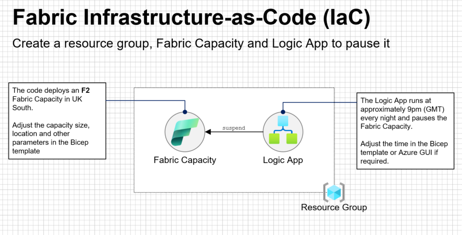

# Fabric-IaC

## Introduction

This repo will create a resource group, an F2 **Fabric Capacity** and a **Logic App** to pause the Fabric Capacity in the UK South region.  Fabric SKU and region can be altered in the Bicep if required.

The code has been built with external subscriptions in mind but could be adapted for any Azure subscription.

## Deploy to Azure

### Parameters
The Bicep template has the following parameters:
- location - the selected Azure region for deployment, eg `UKSouth`
- administrator email - eg admin999@MCAPSetc.onmicrosoft.com

Click the button below when ready:

